# AWS Magic Tagging Resources

This script is designed to automatically tag AWS resources when certain events occur. It is intended to be used as an AWS Lambda function, triggered by AWS EventBridge.

## Architecture

```mermaid
graph TB
    subgraph "Event Sources"
        EC2[EC2]:::aws
        ELB[ELB]:::aws
        RDS[RDS]:::aws
        CF[CloudFront]:::aws
        LM[Lambda]:::aws
        SNS[SNS]:::aws
        IAM[IAM]:::aws
        AS[AutoScaling]:::aws
        EB["EventBridge"]:::aws
    end

    subgraph "Lambda Function"
        MH["Main Handler"]:::lambda
        click MH "https://github.com/timmyeats/aws-magic-tagging-resources/blob/main/handler/main.py"
        
        subgraph "Resource Taggers"
            AST["AutoScaling Tagger"]:::tagger
            click AST "https://github.com/timmyeats/aws-magic-tagging-resources/blob/main/handler/resource_tagger/autoscaling_tagger.py"
            CFT["CloudFront Tagger"]:::tagger
            click CFT "https://github.com/timmyeats/aws-magic-tagging-resources/blob/main/handler/resource_tagger/cloudfront_tagger.py"
            EC2T["EC2 Tagger"]:::tagger
            click EC2T "https://github.com/timmyeats/aws-magic-tagging-resources/blob/main/handler/resource_tagger/ec2_tagger.py"
            ELBT["ELB Tagger"]:::tagger
            click ELBT "https://github.com/timmyeats/aws-magic-tagging-resources/blob/main/handler/resource_tagger/elb_tagger.py"
            IAMT["IAM Tagger"]:::tagger
            click IAMT "https://github.com/timmyeats/aws-magic-tagging-resources/blob/main/handler/resource_tagger/iam_tagger.py"
            LMT["Lambda Tagger"]:::tagger
            click LMT "https://github.com/timmyeats/aws-magic-tagging-resources/blob/main/handler/resource_tagger/lambda_tagger.py"
            RDST["RDS Tagger"]:::tagger
            click RDST "https://github.com/timmyeats/aws-magic-tagging-resources/blob/main/handler/resource_tagger/rds_tagger.py"
            SNST["SNS Tagger"]:::tagger
            click SNST "https://github.com/timmyeats/aws-magic-tagging-resources/blob/main/handler/resource_tagger/sns_tagger.py"
            CU["Common Utilities"]:::util
            click CU "https://github.com/timmyeats/aws-magic-tagging-resources/blob/main/handler/resource_tagger/taggers.py"
        end
    end

    subgraph "IAM Layer"
        ROLE["IAM Role"]:::iam
        POL["IAM Policies"]:::iam
        click ROLE "https://github.com/timmyeats/aws-magic-tagging-resources/blob/main/iam.tf"
        click POL "https://github.com/timmyeats/aws-magic-tagging-resources/blob/main/iam.tf"
    end

    subgraph "Monitoring"
        CWL["CloudWatch Logs"]:::monitoring
        CWD["CloudWatch Dashboard"]:::monitoring
        RG["Resource Group"]:::monitoring
        click CWD "https://github.com/timmyeats/aws-magic-tagging-resources/blob/main/cw_dashboard.tf"
        click RG "https://github.com/timmyeats/aws-magic-tagging-resources/blob/main/resource_group.tf"
    end

    subgraph "Infrastructure"
        LFC["Lambda Configuration"]:::infra
        MRD["Multi-region Deploy"]:::infra
        APC["AWS Provider Config"]:::infra
        VC["Variables Config"]:::infra
        click LFC "https://github.com/timmyeats/aws-magic-tagging-resources/blob/main/lambda.tf"
        click MRD "https://github.com/timmyeats/aws-magic-tagging-resources/blob/main/multi-region-deploy.sh"
        click APC "https://github.com/timmyeats/aws-magic-tagging-resources/blob/main/provider.tf"
        click VC "https://github.com/timmyeats/aws-magic-tagging-resources/blob/main/variables.tf"
    end

    %% Event Flow
    EC2 --> EB
    ELB --> EB
    RDS --> EB
    CF --> EB
    LM --> EB
    SNS --> EB
    IAM --> EB
    AS --> EB
    
    EB --> MH
    
    MH --> AST & CFT & EC2T & ELBT & IAMT & LMT & RDST & SNST
    AST & CFT & EC2T & ELBT & IAMT & LMT & RDST & SNST --> CU
    
    %% Permissions
    ROLE -.-> MH
    POL -.-> ROLE
    
    %% Monitoring Flow
    MH ..-> CWL
    CWL ..-> CWD
    CWL ..-> RG

    %% Infrastructure Connections
    LFC --- MH
    MRD --- LFC
    APC --- MRD
    VC --- LFC

    %% Styles
    classDef aws fill:#FF9900,stroke:#232F3E,color:#232F3E
    classDef lambda fill:#2496ED,stroke:#232F3E,color:white
    classDef tagger fill:#85B09A,stroke:#232F3E,color:white
    classDef util fill:#B8E0D2,stroke:#232F3E,color:#232F3E
    classDef iam fill:#FFD700,stroke:#232F3E,color:#232F3E
    classDef monitoring fill:#7CBA3D,stroke:#232F3E,color:white
    classDef infra fill:#3B48CC,stroke:#232F3E,color:white
```



<div style="text-align: center;">
Drawn by <a href="https://github.com/ahmedkhaleel2004/gitdiagram">GitDiagram</a>
</div>


## Prerequisites

- Install Terraform

- Install AWS CLI

- Set AWS credential in your environment, ```aws configure  --profile your_profile_name```

- Set AWS profile in your environment, ```export AWS_PROFILE=your_profile_name```

## Configuration

Modify ```terraform.tfvars.template``` to ```terraform.tfvars```, and set the tfvars

```
resource_tags = {
  terraform = "true"
  project   = "aws-magic-tagging-resources"
  version   = "v1.0.0"
}
```

## Resources

- Lambda Function
- IAM Role
- IAM Policy
- Log Group
- EventBridge Rule
- Resource Group
- CloudWatch Dashboard

## How to use this

Deploy this terraform and verify the resource tags are created.

### Deploy and Destroy

#### Resources in a single region

- Deploy resources:

   `terraform init`

   `terraform plan`

   `terraform apply`

- Destroy resources:

   `terraform destroy`

#### Resources in multiple regions

- Deploy resources:

   `sh multi-region-deploy.sh`

- Destroy resources:

   `sh multi-region-destroy.sh`

## Functionality

1. **Extracting Tag Information**: The `get_tag_information` function extracts tag information from the event, including the source IP address, event time, and user agent. It also calls the `taggers.get_event_time` and `taggers.get_identity_type` functions to get additional tag information.

2. **Adding Tags**: The `lambda_handler` function is the entry point for the Lambda function. It first calls the `get_tag_information` function to get the tag information, then decides which type of AWS resource to add tags to based on the source of the event. For example, if the source of the event is "aws.ec2", it calls the `ec2_tagger.tagger` function to add tags to EC2 resources.


### Support auto-tagging resources

  - EC2
  - ELB
  - RDS
  - CloudFront
  - Lambda
  - SNS
  - IAM
  - AutoScaling


### Default tags

  -  Owner
  -  SourceIP
  -  UserType
  -  EventTime
  -  UserName / RoleName


<!-- BEGIN_TF_DOCS -->
## Requirements

| Name | Version |
|------|---------|
| <a name="requirement_terraform"></a> [terraform](#requirement\_terraform) | >= 0.14 |
| <a name="requirement_aws"></a> [aws](#requirement\_aws) | 4.22.0 |

## Providers

| Name | Version |
|------|---------|
| <a name="provider_aws"></a> [aws](#provider\_aws) | 4.22.0 |

## Modules

| Name | Source | Version |
|------|--------|---------|
| <a name="module_lambda"></a> [lambda](#module\_lambda) | terraform-aws-modules/lambda/aws | 3.3.1 |

## Resources

| Name | Type |
|------|------|
| [aws_cloudwatch_dashboard.dashboard](https://registry.terraform.io/providers/hashicorp/aws/4.22.0/docs/resources/cloudwatch_dashboard) | resource |
| [aws_cloudwatch_event_rule.event_rule](https://registry.terraform.io/providers/hashicorp/aws/4.22.0/docs/resources/cloudwatch_event_rule) | resource |
| [aws_cloudwatch_event_target.event_rule](https://registry.terraform.io/providers/hashicorp/aws/4.22.0/docs/resources/cloudwatch_event_target) | resource |
| [aws_iam_policy.lambda_tagging_policy](https://registry.terraform.io/providers/hashicorp/aws/4.22.0/docs/resources/iam_policy) | resource |
| [aws_iam_role.lambda_function_role](https://registry.terraform.io/providers/hashicorp/aws/4.22.0/docs/resources/iam_role) | resource |
| [aws_iam_role_policy_attachment.lambda_basic_policy](https://registry.terraform.io/providers/hashicorp/aws/4.22.0/docs/resources/iam_role_policy_attachment) | resource |
| [aws_iam_role_policy_attachment.lambda_tagging_policy](https://registry.terraform.io/providers/hashicorp/aws/4.22.0/docs/resources/iam_role_policy_attachment) | resource |
| [aws_lambda_permission.event_rule](https://registry.terraform.io/providers/hashicorp/aws/4.22.0/docs/resources/lambda_permission) | resource |
| [aws_resourcegroups_group.resource_group](https://registry.terraform.io/providers/hashicorp/aws/4.22.0/docs/resources/resourcegroups_group) | resource |
| [aws_caller_identity.current](https://registry.terraform.io/providers/hashicorp/aws/4.22.0/docs/data-sources/caller_identity) | data source |
| [aws_iam_role.lambda_function_role](https://registry.terraform.io/providers/hashicorp/aws/4.22.0/docs/data-sources/iam_role) | data source |
| [aws_region.current](https://registry.terraform.io/providers/hashicorp/aws/4.22.0/docs/data-sources/region) | data source |

## Inputs

| Name | Description | Type | Default | Required |
|------|-------------|------|---------|:--------:|
| <a name="input_aws_region"></a> [aws\_region](#input\_aws\_region) | The AWS region to use | `string` | `"us-east-1"` | no |
| <a name="input_enable_cloudwatch_dashboard"></a> [enable\_cloudwatch\_dashboard](#input\_enable\_cloudwatch\_dashboard) | Enable the CloudWatch Dashboard | `bool` | `false` | no |
| <a name="input_lambda_function_name"></a> [lambda\_function\_name](#input\_lambda\_function\_name) | The name of the Lambda function | `string` | `"AWSAutoTaggingFunction"` | no |
| <a name="input_lambda_function_role_name"></a> [lambda\_function\_role\_name](#input\_lambda\_function\_role\_name) | The name of the Lambda function role | `string` | `"AWSAutoTaggingFunctionRole"` | no |
| <a name="input_resource_tags"></a> [resource\_tags](#input\_resource\_tags) | Tags to apply to resources | `map(string)` | `null` | no |

## Outputs

| Name | Description |
|------|-------------|
| <a name="output_completed_region"></a> [completed\_region](#output\_completed\_region) | The region that the Lambda function was created |
<!-- END_TF_DOCS -->
